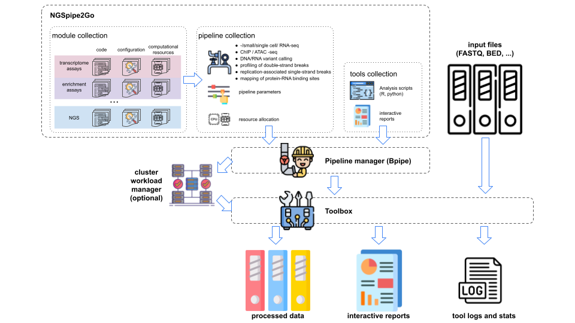

# NGSpipe2go #

An opinionated framework for building pipelines. It comprises set of NGS data analysis tools and pipelines developed and utilized at the Institute of Molecular Biology gGmbH in Mainz (https://www.imb.de/).

## DNAampliconseq_MPS pipeline

This pipeline performs multiplexed protein stability (MPS) profiling of DNA amplicon-seq data as described in the [publication](https://www.sciencedirect.com/science/article/pii/S1097276518302363) of Kats I, Khmelinskii A, Kschonsak M, Huber F, Knieß RA, Bartosik A, Knop M (2018). *Mapping Degradation Signals and Pathways in a Eukaryotic N-terminome.* Mol Cell. 2018 May 3;70(3):488-501.e5. doi: 10.1016/j.molcel.2018.03.033. It is designed as alternative or addition to the [CombinatorialProfiler](https://github.com/ilia-kats/CombinatorialProfiler) tool allowing for flexible amplicon design and UMI-deduplication. UMI deduplication and extraction of the variable region of the amplicon is implemented using [UMI-tools](https://umi-tools.readthedocs.io/en/latest/index.html). The variable region of interest is referred to as cell barcode within the UMI-tools regular expression describing the amplicon structure. The downstream processing of the count data like background subtraction and calculation of protein stability indicies (PSI) is analogous to CombinatorialProfiler. All processing steps are illustrated in the pipeline [flowchart](https://viewer.diagrams.net/?highlight=0000ff&edit=_blank&layers=1&nav=1&title=MPSprofiling#R7R1Zd9o689fknPYBjrHBwGM22vTcNr1J%2BvW2LzkGC3BjLNdLEvLrv9HmVXYMGBuaJmnBsixLmtHsGp1o56vnD57hLj9jE9knqmI%2Bn2gXJ6ra0wYD%2BCAla1YyEgULzzJ5pbjg1npBvFDhpaFlIj9VMcDYDiw3XTjDjoNmQarM8Dz8lK42x3b6ra6xQLmC25lh50u%2FW2aw5KU9fRzf%2BIisxZK%2FeqQO2Y2pMXtYeDh0%2BPsc7CB2Z2WIZvgY%2FaVh4qdEkXZ5op17GAfs2%2Br5HNlkWsWMsecmBXejLnvICao88FH5NF9%2BGQX24%2FJm%2BuXj7eT%2B5WNHAODRsEM%2BFyeqbkODZ6b1SGbXthYOvaH%2FDklXzzw6DdElfFvwT%2FrY1MuWQJdoW6KUTkawFnO%2FDFY2fOvBPduYIvssmtJzbGOPVtIm9Aeq%2BIGHHyIgwSSezbETcIzq6aTfhr9EJm%2BRthNdzS3bTjaqkt%2BoUXGHwlA7W3iGacHcZopneGXN4FIhVWzD9%2Fn3CLwKfW1gBBYmE9cZK9Gok8Di8HtEXoCeE0UceB8QXqHAW0OVZ7GmdPYIX2OdEUfOpwTGDnnZMoGsfUXjK4WvkkXUdowu8IVjjBx7Hmdf%2Fr39Hn4KL15%2B3l3dTX74jz87vTeNPpc6%2Bd0H%2BtSALepISWFLRGoT2NJXJNiii4q7YMvL9%2BDiTvnv56fJzaW36pl3H9ZXnUEvBzxkAhnml9gLlniBHcO%2BjEsTECATE9f5B2OXg%2BUXCoI1B6ERBhiKEkiBnq3gP%2FJ4d8CvfiTuXDzzlunFWlw4MN7EQ%2BTyR%2FJe%2FBi9ip8zTwk3gssZgS2BNCmcWLboTh4BUwhXCHkfh94MlaxFvsYDw1ugoKwer0imvhSRPGQDDXtMc8hdkGKFQ%2Fvyw4uifw1%2FDc9%2FXj9at986%2FaPDiV4KI2IEKcCJPMBrhbF0UlsDcVmvi3hEmtoTcpzCB8EoyI2OTyF6ChV6ffdZwkXO1ZPTs5VhOWSGLRfZFlBdKDwrZzDsreV859UuC6lWdKpXzOUMQnQ9NE%2FVXwYBEXdPyWyrk4UVAD%2FrerbbdQDY6sRaTecYAA9fv3y4JYNTFxguOvBvauMpfHz%2Beut6GNiU5SzgUkyAD98vvpwaK9e2QIL20e9cwT082hX1u8A%2F8eO6uPsEp8kbtgVTpXcLIIiX5aBjNDSrJnok6k6d06nMOOuPC2GYncALnZkRAGlL1t12LRB9IPornrXN0X%2F7HtWxxjuUslmBMYWnE6sctE80txyLyt2q8m5K7ryvc9m3P24bG6ZPCbfvgh5MSDfooGSgROPEZmgT7Dz%2B8SHfB%2BZoGYS3GKBbi8F1yLCtOchVlIEawKCQt9WAa8DBZzQLAzLfCRws6EmxzrIHUX8kkfSFUJ%2BU9HtqDZK%2BlOP3JRw%2FMwWg77jkK%2BhDLmhGZPBMaBOS0kgURHaXvnS6SkWOynPYy02ZKpkxUVZZbuLv%2B4otim38ZR11kALYMN0Ans99wpsyQIg6vYO%2BPmhT2hbfE3JzBQ2sPWm7p1ZVqRoSt7%2F5yLue%2FiIGUCCVxNghEaclJG2KnwlFI0IhpWlT7JnI60AxEQ2opMARn1I8BbB8EN1JWjhPqSihoT75jWq4hmlGbatlDOIAxF4GTL8bPEuMUOmbkdwwOXThs2BQm0iZm8mMb2qwcgFCyJ%2F55Va8lrKyBVqlRwAr3XeNGV1MiQaVXK1oySVqqcXrLphic50rzEnEgSlK0LOLPGuFnNQ6yE1L%2FEC%2BCVFiydpUHBDdEg1ZlRonhflOlwzDD6f3VFKrfzSEJLpE9vMJdlIpEM8JOYd%2FQI%2Bkb5UNtGJPNh566Fi%2FQ3QfdfDeMusbPGuSShtETJ9bsRAubXxP4HVhbSOTjBFoP7pP4tTuY2QTSOZvCTIPXbzeSkA5WNLRO25I7xh%2B8DuD1E3Ow9wzZkzrrWvwcYtsvJQyUWHFtxYOIaYKSHkM26dW%2BYv3NOjXXrvReC2QcIkw5ISrKcFlNmoyVqqCgvSOHN8K1i0O1%2FBm2KQL2kSrkLjGbdLlumaAt8%2FwPH5Jh7yFilXKO4vMiYMQKAPlZpU9TUG3261vvBiWMB2nERh0cAsHe4mB1U2rSaGMC1OBhkoSSVtBuRanJtQLrvYlNDqi9Fozwz7lrteAqGlnwhFrozkdPtSa29RTNafOqaTC9rS0AnQLgghp8ckz3Khfu9kp0maK3kCmdMu0bhGFsYGqBJcJbWkDFTmK1virIreh%2BcoNJlnU0cZ6ugmmy%2FOn6rebqKO%2FSFHdbiKsfUdjN3GlatwKug%2B8nmpqihubSlh5h5JVck9P3ANKGHQ4qT2lcpPDDNRF0S6i4GvsxZDZtaeVWJGbLVvmam01VMYzyM2R3LpzltCgD8DGE3kPuo%2BG5xd6M4uqHaTV49Ux7dX%2BkcOs%2FeBRRkYDgD9aVCZN%2BoMS64MpITDCk5Qf0LYeUEYBB3mWSPMnwp3koUVoGx6r5UHzoOz4kfAbC8OwnjPK1WuCIR0vdVZ9gW6moMXtp4WjZI%2BRmZV6uZR32A26m0uoCeC9Kluq5bLl4UmR%2FX6%2FO6gmR%2Fb6m7OO7eVIWdRLoz4w8cKDdYL104DcgxPs%2Bu764ddydP%2F7v7tAndx%2F%2Bd7Tp51WoxCPTpbrH5gsV3H1yTzQhyjsAX%2BfW4vQo9HiydCNvxJfRuJjM0Vuk9pddlko28krFYo4WQYuyn3XcBqSAouGC9KJsZraqFiOldRoS4St1Ou9SqoyiDUnwB6YIkT2UBXjTeZupcVRvCxan%2FuMWJ0roNGBhOY%2BYe%2BBBJrRth1jQWVr0AEoL%2FQjFUEmZ0tk9QjTGR%2BD5hl%2Fot9B9hKaBWvUxjNB6rm%2FEKSItW%2F5J2zHm9%2BFL5%2BxH9D7ASIaywNCLtVg5kZo06A1EDUA%2BrTuFTXK44L%2BSodKX8bs%2BESpiNulNxKL0g69hIP6PXnz69NM8JjHxvGNMqIBMnY7RQhomLaEVJfb%2BWXuBVlZRu85aDVG71VUYtS9beYSQWktaiz9TWfxjWgs2ttTWeraFVV5W5RetwJDHz31PGOdqOASlPKLcWyopOmCxpf7pGJ9dTjMYCDrQUV8fM1SHmklE8MP%2Fj2n%2FLiKyvI7BJJL3edA5wHWtmB%2FnvFE55SGfZNxgCzzwN5Zu6gUxceTB%2BB%2FGrYx6y7h5YQvvmobY7hUaBuT0cYMo%2BHBXf%2FQqwtNL2AvdEsqb1hJL8oaOM9AGWVQJh8v3tMlZFSUNWE%2B0%2FLMKA1NJVaiM6SRqOWJqedaeXpWyVRm%2FeQryzQp5cxAKS654XOhnRTs%2BaXbvqk3nwGOr3bo1uAM%2FmD%2BzgktHEA3z%2BG6F1%2FDH6nuBecgGwaeYVHwIsDQJ%2BQHJ%2FltyjUggjZSuulAdMHSXhNCtP7GmJADu657%2Bq%2F50l09GEvNfMbWwxet0zuaLcK1buvUKzKpvlI3k9ptY6cukRirqnh0Xw1X9JQtrGrXYcCj77BN6HfMihJ8SPk9K2NQ7VnQIvURR8OwmA7JPFBxv6u4dHaP%2FkmSF5EVYWKsLJvg%2B0dkPyLSaiOa0bA%2FzBClYTWqtAV%2FqojnwwPDcyWH6h7yQYcvNSC3bS6OnaozINgJlG%2FDSPf19opu3KMGESec2QgHzLDD7DSA%2Bg4Gpk%2B%2B%2B%2Bh3iJxZeWhvo0auN08TBuq4qtd3tDfuNzp4qmDjxYGSBOhZR3C8GbZtUA%2BoNZJxP2TMliexjfWwUHwP6KwLU1sjLO47mj0txv2wczqeI%2Felc%2Bf83NEpTkXscOWK%2Bgu67huyOdUpiQsB%2B1VJfFy7uWi3DdfFebgORRL3EFFvD5QcteG5o%2B4e%2BIwmZuIvLWd9v3L9e1YG9e5JLYISrt9lhd2blcRDmru%2Fsav7QAdNb8Od7hLZIK353Rv54KX1ioWlaFq%2BwjNAKCIEJWjsYbLRKxFQSDlVNzFZkbvpMzatOVnndNZpRUrGA8K%2FZqEfsKYMz%2BjQKL7YExjAZPtLWDGR41C45LZ0av15Ut5QkrNOHtknTJq7ENZL%2FWI2fgnta%2FN%2F6%2Bn1h%2FD8yrzr9FrNT3Zs0WL9A3GiZJyrA%2B5cLXSiZOuPBhnESThR8k9ndRP%2BdNRdJkzUsTlFmuxtvDOG1iq6bZdnMY2zWgs4%2B7rxtd%2BQyFfZCSf2hDJ7SlVfHMA9JEFCRkBY1bfPVzFPEoYZ3nCTLrlc7FJqcNWddAycDTjpas7hNO6liEh%2FlDdvNOmUkzLDVnfBNZG%2FtVa6MqpKV1pTJaVAFtmoDoWfHJ0MVBXuwjB5YMJSf0NhqT8sEZZqjDg5NU3gVWeMK9yRgMcJTbuRsnzKOF8yKtUwqboFDUU87%2BycxV6esDCUE5bGg2p7125APvgeMEKMCR%2BwLb88j0w6DLY9DgqDDVcW56MBpuEuGzDS0VEy0mx0i3aIjPR4Avo2oIz7TgKg6%2BlglZyeVZAEoEGFrTIxSy3iqoL7zLBnoc3Edng6QDR82g%2BMqcWD6yzHtFgI%2B7uvt1fv2yQ%2ByZobEJ3%2BkRKdDGoODjCkTsgbB%2BMjkEQxGE8kH889YM6MbPk2yxZGe94Cke9LODC5uZfLCdSPmVKrz0g6OCMIjNkyTp1FhI1I0jg7T0oX5EmabMlHwjH61%2B%2FPhE2tqte%2FBkepNEJR3d3cVpsSHHHrjZTg6PyKBpShscS4Jg%2F8PCx%2F6rg4svHgk%2BxGhDLhE6SoVE5L31qKUzYl6fhLIjgBkgPcWDAKcwRmfauC3j84VuC9j651EICgXWfqM%2BKnRDF5bKuDbA8EDzaL9wD6AXL93dPc7Sur6N%2BO7Z7b7xhS9Y1Fyj3hiZXstOuNZHxX350iyw8P290s2bJT6zUj5FaHh23Pmntix%2BmRpfaI%2Bt2KHnPlVAl1YmrMcSgv714s100nPm1nw75DYq4XjD0%2BkmxfNP0wCwh1DYuxZMQlpKoxMg32%2F7bXvel1mZV18XKYXVS7N%2BoWXWxPr6yBl2X8FWreNFMQU1SDCim3%2Fv5NMbuJClk1F21jm%2BMqW3lpTOINj3SsauXlE0LIYCIdNyz4BxM%2FOSdxnGJ7tl0Ra0nGVd22O06C45hsu2mH0rAvEYUbtO3Kj%2FEuFIlymLbbwWf%2FoAVhwTEmF5y4Ni1kHnx7dgJI0q3UybOWeVFuR3fhDm4ZVqQJaA2IMexnGIuewwvpsWtqDXxFigT5jJPpkwFzoNhuydUxdcIXEXng8ktKlsilv6%2Bp2yVdoJ5VKRKGrPzx53ReZZJaynrkJjMECuC0rjqU2krqyba0B%2BTqiVPOk9jVl2HXYE%2FY1WRipVL0frt5laTTcoRGfm5PnDBrdclyfGvm%2FFYNwH87dkQm87S4CYtQoT%2F1MJ%2BxrqUlm7xQ2BM%2B7RTvUffEe9pMXcHPR5vgTPBHRTHiCESb47KEZZFTLhnJsLMGr44UOzdNoUBk4o7oGUVRxq1KLJ9VWpE3chUAIGfJHcuxmZQ%2BFvosnyr3CeT2b%2BZwuUisyHVIl%2FfogiVFpHYfarynAX8sIlDmXqbe5HKhINfHUnzfXXnna0K%2BcF7X25fYs15gfEb0%2Fkj60OpZJDn1oZ9fJOponF8kdeRmkNuL9RwcWrMXD7czGA83txjnN5EUAjdpQ%2F4xtj%2FdWVeX09vbZ7zG608%2Frr91qpqQRUqXA9uSMdTUJBK9Wl%2FXm0kCyhO3UGvFPyTVTOVIZuyuKTz8B%2FIKmqWGRUVGogIvFBJDY8buleUTdcVwEA7JNR8jtaT5XVavq0qt3sWod3RG7%2Bx2RH2kS%2FItNWn2vn08ffrQu8X312fj62%2Fa89fl6qHdo1yU7kauNLj4So%2BjorbrNLXspamluif%2FmhRBJQe8lNHQ5qNApJDPW9COE%2FI7b3yvk01WPetn3BouyOWjP4UMZIWmdqmAdK5biwUr63Ulw3ro2eszz5g9kPG9xkLTqc1oWmcSjqRddMYbznx1ntsfapl0zH3hpUiqHlqe5WrDGjwX8s3gg8NRPbbTPLbgpVuSVOnRDZJ1JT%2FiQW1rYUlzyrSqcdYRbLsn2lkVxqWZAQ4nQMlFhldZaTN8H62YB4nsXSMhmQ3qZbkgJNJ3qRpWDKOjV8M0SYL%2BJpWwUtJ1BPtKBQqbZRjfnhMi0T0lE6b9BrwT2b2emjaqmuNZr8F7VrotsUzCTMwCpbVnkZs%2F4WOc0B8p48me7JE6%2BSgtiCbt6tDopU5%2BTwqM8AvPMC0AR6YYaBzZWUK54IIfxEg54tIwKRYoaYm3LsfoMG2j1EZ52bY3lJjVNWVfwNWKk%2BYyR80G0Vv0qdDOltiRx%2BjfrHuGpp%2B3cbw%2FkB2FlNk4Yuci8%2BMSsnIfLfRE0RHA5QfUW8Ujhg3TcPkh6aBusq0VNTQrPxqdb2TELrmkp7QnUuUQGgY9SfRASsfK%2BnRD50akp6MRAomN9364AgK7znS4UsNLqI1hpawiMIiXJAGxcX%2BLjxcQhwnE2QF26P0KmZYRT7%2BLMWMeqdfTowzIZ%2FY0g93fb9BFFu9zZYl0FyC6OjF02FvIBQ5ZcsEoDIq8fJrAonc064GLfd8CCL%2FfcPqhML8Cs17PDPH%2BY6KRx4MMfR1XPMupllQJcuPB0WQ5avPYwjIz27GeWqjroyT2HMyphZ%2BBTlkbHFvISCPBNFX59zyWxhvTetlBhSvS7YKTCovR5%2Bi03exOG12TbAtoPXVbPmRJ2CWgFAZ4DnfP85Tvj2E0qhDSxdod55W08Z62vcghMi6DSD5%2F%2Bx8Dib4%2BzDgMND3P9BuFhZpXqd7W6sifqTmQHF%2FXLEzymwPfyProp%2FlJf6w1BgmpV6VVZ9oB58%2BWTpZEBC7zvhyI46zVFOm1hGo2FoJSFepH4ks7DwNqcqvuT5MY6BpWLGa8z1LNohg%2BDWgW%2Bz0CPetXiw60bkbTgCIP4yCp3sKol5%2BxSbDr8v8%3D). 

### The pipeline includes

- FastQC for rawdata quality control.
- optional adapter trimming with Cutadapt.
- read pair assembly with PEAR.
- extract UMI-sequences and cell barcodes with UMI-tools extract. Barcodes and UMIs are attached to the read names. Definition of the required regular expressions is explained [here](https://umi-tools.readthedocs.io/en/latest/reference/extract.html#barcode-extraction).
- optionally, generate custom whitelist for filtering and correction of cell barcodes according to the observed barcode (and UMI) distribution. 
- deduplication of PCR duplicates by UMI-sequences using UMI-tools.
- optional sample demultiplexing by 2nd barcode sequence (as in "amplicon3" experimental design).
- barcode counting with UMI-tools count_tab (or awk depending on experiment design).
- remove background noise by fitting a Gaussian mixture model to each sample and subtract the mean of the background distribution.
- calculate protein stability indices (with and without background subtraction) for cell fractions coming from the different signal intensity bins.

### Implemented experiment designs

- "amplicon1": Paired end sequencing with overlapping reads for assembly. Amplicon sequence contains cell barcodes to count and UMIs for deduplication. Other elements are optional, but must fit the regular expression given in essential.vars.groovy.
- "amplicon2": as "amplicon1", but without UMIs. Remark: the regular expression still needs an UMI segment for reasons of compatibility with umi_tools, though of length zero: (?P<umi_1>.{0}).
- "amplicon3": As "amplicon2", but with an additional barcode in read2 for sample demultiplexing (i.e. 2 independent cell barcodes but no UMIs). The 2nd barcode is extracted by an additional umi_tools extract step to keep it separated from the 1st barcode. It is copied as sample name into the 2nd column of count file (if both barcodes were extracted in a single umi_tools extract step they are merged in the read name and not separated by "_"). The occurrences of all CB combinations are counted.
- "amplicon4": Paired end sequencing with non-overlapping reads. No pear assembly of read pairs before barcode extraction. Contains two independent cell barcodes (one in each read) but no UMIs. The occurrences of all CB combinations are counted.

### Programs required

- Cutadapt
- FastQC
- MultiQC
- PEAR
- UMI-tools
- R

## NGSpipe2go preparations ##

### Put NGSpipe2go into the project dir ###

NGS projects should be run in a consistant and reproducible way, hence NGSpipe2go asks you to copy all tools into the project folder, which will ensure that you always use the same program versions at a later time point. This can be done either from a local NGSpipe2go copy or using the most recent development version from the GitLab repository. After cloning, cd into the repository and switch to the MPSprofiling branch.

    git clone https://gitlab.rlp.net/imbforge/NGSpipe2go <project_dir>/NGSpipe2go
    cd  <project_dir>/NGSpipe2go
    git checkout MPSprofiling

### Create symlinks for the pipeline ###

Go to your <project_dir> and make symlinks for the pipeline in the main project dir. 

    ln -s NGSpipe2go/pipelines/DNAampliconseq/* .

### Customise NGSpipe2go to your needs ###

- *essential.vars.groovy*: essential parameter describing the experiment 
  - project folder name
  - experiment design (see below)
  - regular expressions for barcode and UMI extraction
  - whitelist options: you may provide user-prepared barcode whitelists to filter the extracted barcodes using the ESSENTIAL_WHITELIST option. If ESSENTIAL_CORRECT_CB is set true, non matching barcodes will be corrected to barcode alternatives given in the whitelist. It also possible to generate a whitelist with likely true barcodes from the data set (as described [here](https://umi-tools.readthedocs.io/en/latest/reference/whitelist.html)) by using the ESSENTIAL_EXTRACT_WHITELIST flag. This whitelist would also contain possible barcode alternatives for correcting if possible. For each barcode extraction the user may use either the ESSENTIAL_WHITELIST or the ESSENTIAL_EXTRACT_WHITELIST option (but not both).
- additional (more specialized) parameter can be given in the header-files of the individual pipeline modules (e.g. Hamming distance for correction of barcodes to whitelist barcode in *addumibarcodetofastq.header*). The flowchart given above links to the header files of each module to inspect the default parameter set.
- *targets.txt*: tab-separated txt-file giving information about the analysed samples. The following columns are required (additional columns ignored): 
  - sample: sample identifier. If no sample demultiplexing by a 2nd barcode is necessary, may be same as file.
  - file: Unique short form of the input fastq file name (common prefixes and suffixes can be removed; no dots allowed in file name other than for file suffices). These names are grepped against the count file names to merge the *targets.txt* information to the count data.
  - experiment: experiment name
  - sub_experiment: summarizes those samples, which have been distributed to stability bins and belong together for PSI calculation
  - fraction: numbers of cells which were sorted into each fraction (bin) depending on their mCherry/sfGFP signal ratio (you can also give percentage or fraction of cells for each bin of a sub-experiment. This will influence the intermediate normalized count values but not the final PSIs).
  - bin: index number of signal intensity bin
  - barcode_demultiplex: (only required if design is "amplicon3") 2nd barcode for demultiplexing fractions (bins) from count file

Optionally adjust some general pipeline settings defined in the NGSpipe2go ***config*** folder:

- *bpipe.config.groovy*: define workload manager resources (default workload manager is "slurm", if not needed set executor="local")
- *preambles.groovy*: define module preambles if needed (or stay with default preambles)
- *tools.groovy*: define default versions and running environments for all installed pipeline tools, modify accordingly if new tools or tool versions are installed on your system. If you want to use a different tool version for a certain project you can overwrite the default value in the pipeline-specific file *NGSpipe2go/pipelines/DNAampliconseq/tools.groovy*. Currently, we are using lmod, conda and/or singularity containers as running environments. Conda itself is loaded as lmod module if conda tools are specified. If you want to use conda but haven't installed it as lmod module make otherwise sure that it is available in the path.

## Run the pipeline ##

Copy the input FastQ files into the <project_dir>/rawdata folder.

You may use GNU Screen for persistence when running the pipeline. Load the bpipe module customised for the Slurm job manager, e.g.

    screen
    module load bpipe/0.9.9.3.slurm

Start running the pipeline

    bpipe run DNAampliconseq_MPS.pipeline.groovy rawdata/*.fastq.gz

## Compile a project report ##

The results of the pipeline modules will be saved in the ./results folder. The final report Rmd-file is stored in the ./reports folder and can be edited or customised using a text editor before converting into a HTML report using knitr.
    
    R usage:
    rmarkdown::render("reports/mps.report.Rmd")

## PSI result tables in report file ##

The mps.report.html file contains overview statistics for every step performed in the pipeline. Finally, 4 result tables are given with PSIs calculated with and without background subtraction in two versions:
- PSIs calculated per nucleotides: Protein stability indices are calculated per nucleotide sequence from normalized count data. The statistics given in the table refer to count data of all fractions per sub_experiment and sequence. Column ‘nfractions’ gives the number of fractions (bins) with counts detected, while ‘totalfractions’ contains the total number of fractions for this sub_experiment.
- PSIs calculated per amino acids: Median protein stability indices per amino acid sequence are calculated as median of PSIs from all nucleotide sequences translated into the same amino acid sequence. Additionally, pooled PSIs are calculated directly from normalized count data by pooling counts from all nucleotide sequences translated into the same amino acid sequence. The statistics given in the table refer to the pooled approach. Column ‘nsequences’ gives the number of nucleotide sequences translated into the same amino acid sequence, ‘nfractions’ gives the number of fractions with counts detected for these sequences, while ‘totalfractions’ contains the total number of fractions for this sub_experiment. 

